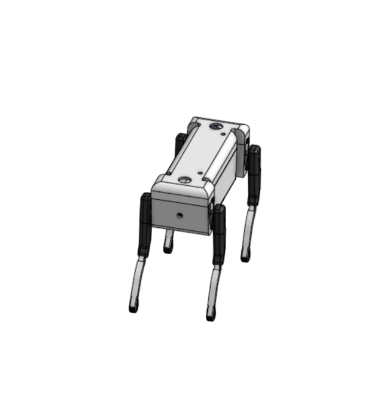

# 🤖 Smart Quadruped Robot with Web & Voice Control

<p align="center">
  
</p>

<p align="center">
  
  
  
  
  
  
</p>

---

# 📖 Overview

This project presents the conceptual design of a **Smart Quadruped Robot** capable of autonomous navigation and future remote operation through a web-based control platform.

The objective of the project was to analyze the supplied hardware components, design the robot's functionality, develop a navigation algorithm, and create an exploded-view assembly animation using **Onshape**.

In addition to the mechanical design, the project proposes a future web application that enables users to monitor and control the robot remotely. The planned website will include a control dashboard and voice-command functionality, allowing intuitive interaction with the robot through spoken commands.

Although the robot has not yet been physically assembled or programmed, this repository documents the complete system concept and serves as the foundation for future implementation.

---

# 🛠 Hardware Components

| Component | Quantity | Purpose |
|-----------|---------:|---------|
| Arduino Uno | 1 | Main robot controller |
| ESP32 | 1 | Wireless communication and web connectivity |
| Servo Motors | 4 | Control the robot legs |
| Ultrasonic Sensor | 1 | Detect nearby obstacles |
| Breadboard | 1 | Prototype circuit connections |
| Jumper Wires | Multiple | Electrical connections |
| Quadruped Robot Chassis | 1 | Mechanical body |

---

# 🤖 Proposed Robot Functionality

The robot is designed to operate in two different modes.

## Autonomous Mode

The robot navigates independently by:

- Walking forward
- Detecting obstacles
- Stopping before collisions
- Changing direction automatically
- Continuing navigation

---

## Manual Mode

Through the planned web dashboard, users will be able to:

- Move Forward
- Move Backward
- Turn Left
- Turn Right
- Stop the robot
- Monitor robot status
- View sensor readings

---

## Voice Control Mode

The proposed web application will include voice recognition, allowing commands such as:

- "Move Forward"
- "Turn Left"
- "Turn Right"
- "Stop"
- "Resume"

The command will be processed by the website, transmitted to the ESP32, and executed by the Arduino Uno.

---

# 🧠 Proposed Algorithms

## Algorithm 1: Robot Initialization

```text
START

1. Power on the robot.
2. Initialize the Arduino Uno.
3. Initialize the servo motors.
4. Initialize the ultrasonic sensor.
5. Initialize the ESP32.
6. Set the robot to the ready position.
7. Wait for a command or start autonomous mode.

END
```

---

## Algorithm 2: Autonomous Navigation

```text
START

Repeat until the robot is turned off:

1. Move the robot forward.
2. Measure the distance using the ultrasonic sensor.
3. If no obstacle is detected,
      Continue moving forward.
4. Otherwise,
      Stop the robot.
      Move backward a short distance.
      Turn left.
      Measure the distance again.
5. If the path is still blocked,
      Turn right.
6. Continue moving forward.

END
```

---

## Algorithm 3: Web & Voice Control

```text
START

1. Open the control website.
2. Connect the website to the ESP32.
3. Wait for user input.
4. If a button is pressed,
      Send the corresponding movement command.
5. If a voice command is detected,
      Convert the speech into a command.
      Send the command to the ESP32.
6. The ESP32 sends the command to the Arduino Uno.
7. The Arduino executes the requested movement.
8. Repeat until the connection is closed.

END
```

# 💥 Exploded View Design

The robot assembly was modeled using **Onshape**.

🎥 **Watch the exploded-view animation here:**

<p align="center">
  <a href="https://youtu.be/fQrN-KyECzs?si=QRc1Q38NxV-l24Wo">
    
  </a>
</p>

<p align="center">
Click the image above to watch the exploded-view animation on YouTube.
</p>

---

# 📜 License

This project is intended for educational purposes and personal portfolio use.

---

# 👩‍💻 Author

**Nassebah Al-Dubayyan**

Computer Science Student
<p align="center">
⭐ If you found this project interesting, consider giving it a star!
</p>
